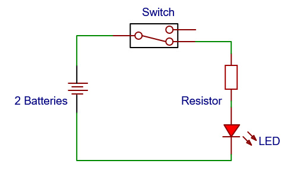
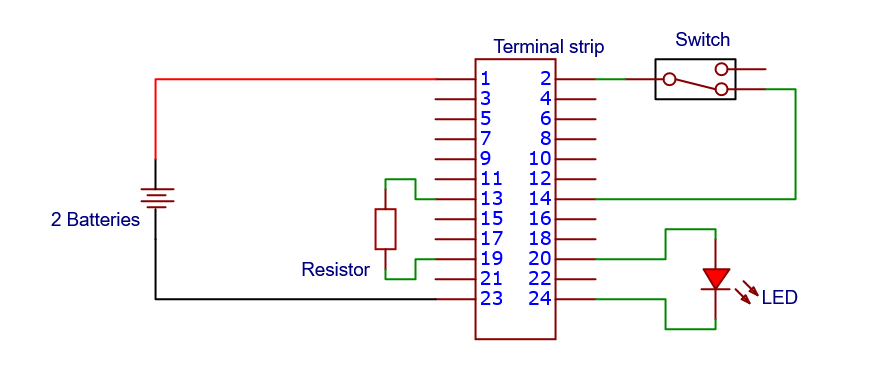
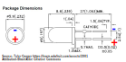
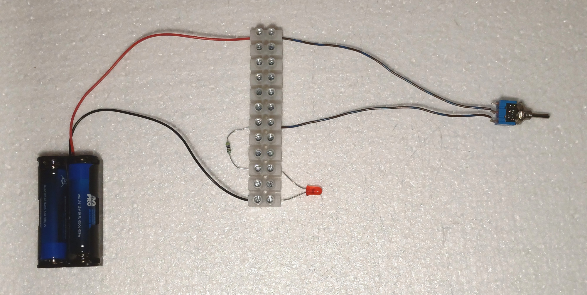
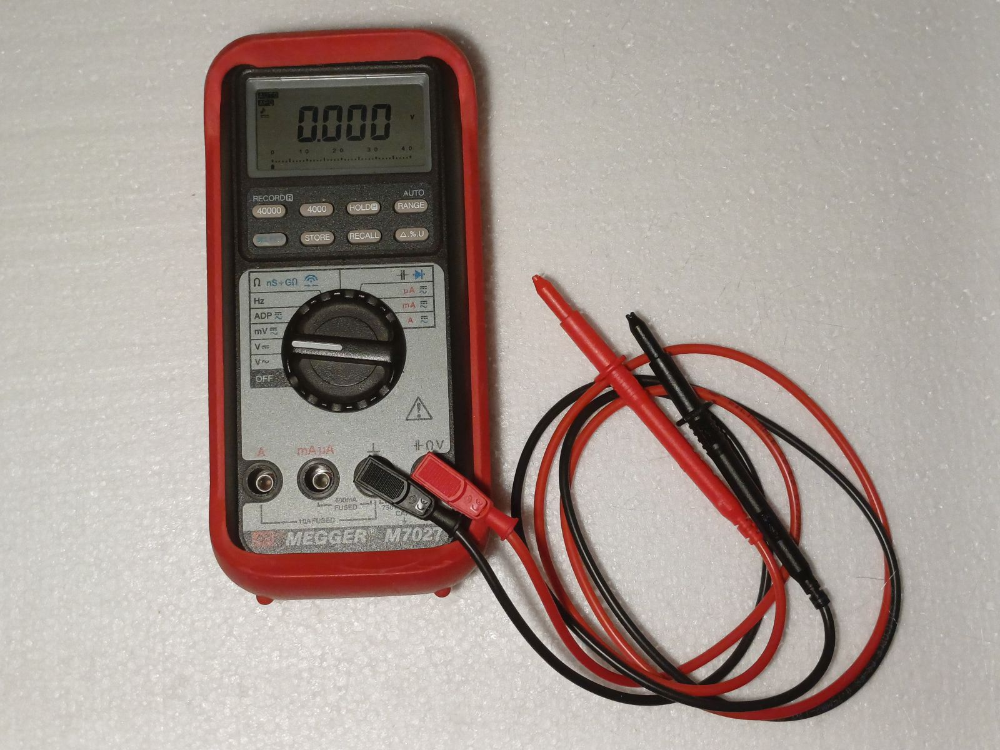

# Circuits and electrical measurements

In this lab you will assemble a simple circuit and measure voltage.

## Schematics

In this circuit, to light up an LED, you need a power source: two batteries, eaach with nominal voltage of 1.5 V connected in series, giving a voltage of 3 V. Besides that, there is a switch to turn on and off the circuit, and a resistor to limit the current. The schematics is as follows.

The LED, when lit, presents a nominal voltage of 2.2 V. Then, the voltage drop in the resistor is $V_r=3 - 2.2 = 0.8$ V. Using this voltage drop and Ohm's Law, the current is $I=V_r/R=0.8/47=17$ mA.

## Polarity and how to build the circuit

We could build this circuit simply twisting the wires or soldering, but this is not good for a simple prototype where we wnat to reuse the components. Another options could be a [breadboard](https://en.wikipedia.org/wiki/Breadboard) or a terminal strip. Here, we connect parts using a terminal strip. Note that the connection is between two terminals (1 and 2, 3 and 4, 5 and 6 in the next figure).

The batteries have polarity, and it is easy to know because it is written :heavy_plus_sign: and :heavy_minus_sign: in the body. The colors of the wire from the battery holder are also standard: red for :heavy_plus_sign: and black for :heavy_minus_sign:.

An LED also has polarity to be checked. There is a cut in the LED cap for the cathode (:heavy_minus_sign: polarity), and the terminal should also be a bit shorter. If not easy to identify, simply build the circuit and if the LED does not turn on, invert the terminals.

Next image shows how your circuit should be when assembled.

## Measuring voltage
To measure voltage, connect the red cable to the terminal marked with a V and the black cable to the terminal marked with GND or ⏚ or the symbol for reference (⊥).

Then, set the multimeter to measure DC voltage (symbol V⎓). Measure the voltage provided by the batteries (terminals 1 and 23 in the terminal strip).

Measure the voltage drop in the resistor and in the LED. Complete the table and add it to your notebook :notebook:.

|Voltage  |Nominal|Measured |
|---------|------:|--------:|
|Batteries| 3 V   |         |
|LED      | 2.2 V |         |
|Resistor | 0.8 V |         |
