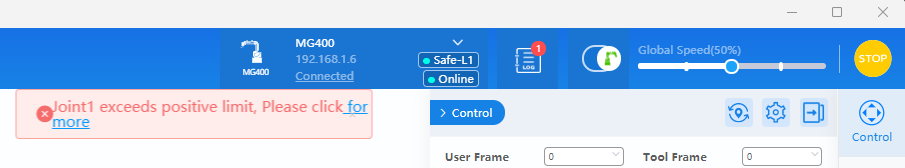
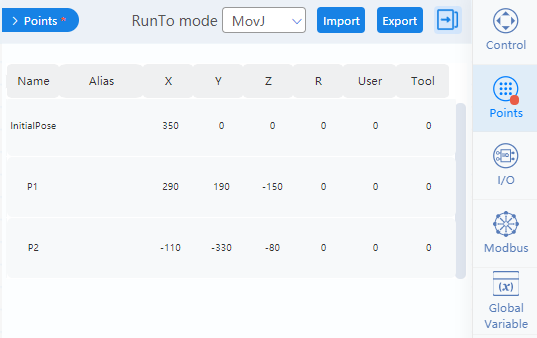

# Basic safety rules

The robots we will start using in the lab present low risk of injuries if you follow the basic rules:

- A robotic arm moves, so always keep fingers, hands, hair, loose clothing, gloves and tools away from the reach of robot when running a program.

- If you are in doubt about any procedure, **ASK** for help **BEFORE** doing it.

In the support page of Dobot
https://www.dobot-robots.com/service/download-center, download the **Dobot MG400 User Guide**.
Read the safety information, pages 1 to 6.

# The robotic arm Dobot MG400

Check in the user guide the general information about the robot (page 8) and answer the [activity in Learn](https://learn.hamk.fi/mod/hvp/view.php?id=802839).

# Connections

Take the robot assigned to your team and position in front of the computer table.
Lock the table.

Connect the power

Connect the emergency button

Connect the network (lan) cable to LAN1 in the robot

Connect the other end of the network cable to the switch bar port PC ETH.

Turn on the robot. The status LED should be blinking white. It means the system is starting.

According to the manual, pages 8 and 9, the LED status shows the following information

| Color          | Status | Definition |
|----------------|--------|------------|
| :white_circle:White           | Flash  | System is starting
| :large_blue_circle: Blue | Steady on | The robot arm has been started but not enabled
| :large_blue_circle:|                      Flash | Hand-guiding status
| :green_circle: Green | Steady on | The robot arm is enabled (not running project)
| :green_circle:|Flash | Automatic running (project is running)
| :red_circle: Red | Steady on | General alarm
| :red_circle:| Flash | Position limit alarm

# Network setup

Dobot MG400 has a fixed IP address, and to connect to the robot, we need to modify the computer network settings. The following steps consider you are using the Windows machines in the network lab.

Open the network settings in Windows (icon in the taskbar)

Select the ethernet network that is currently not connected.

Now, you need to change the IP assignment from automatic to manual (fixed).

Then, you change the IP address and subnet mask for IPv4.

After saving, confirm you have the following settings.

# Dobot Studio

From https://www.dobot-robots.com/service/download-center, download **DobotStudio Pro 2.8 for Win64** and install it.

When you open, you have the following screen.

**MG400** should be available and you can select **Connect**. If MG400 is not available but only Virtual Controller CR5, check the connections (power and network), as well as the network settings.

When the robot is connected through Dobot Studio, the status LED should change to blue.

There is another step after stablishing the connection: you should enable the robot to use. You do it in the icon of the robotic arm in the top blue bar.

You are requested to set load parameters. For the moment, since no tool is connected to the tool flange, you can leave all parameters as zero.

The icon should turn to green, as well as the status LED, and you start hearing some humming from the motors. 

## Emergency button

Before starting to use the robot, let's make sure you know how to stop it in case of a problem. Locate the emergency stop button.

To stop completely any movement, press the emergency button.

The robot becomes disabled, as seen in the icon, and a log message is created.

Open the log to inspect the alarm.

To clear an emergency alarm, first solve the issue (in this case it is only training, so no problem with the robot), then rotate the emergency button in the direction Reset.

Finally, press **Clear Alarm** in the Alarm window in Dobot Studio.

Practice this emergency operation three times. Make sure all the team members know how to use the emergency.

## Control Panel

In the left side of Dobot Studio window, you find a control panel, with a virtual copy of the robot showing its current position and two jog wheels. In the first, you can move the robot using **cartesian coordinates**. In the second, you control directly the **joints**. 

Start with the joints. Press J1+ and then J1- until the robot reaches the limits of the workspace. What are these limits? Check Section 5.4 (Workspace) in the MG400 user guide.

When you reach any joint limit, an error message is presented as shown in the following image. To return to normal operation, simply use the control panel to move the joint back to a position within the workspace.

Test all the other joints and also the movement using cartesian coordinates.

Another way to move the robot is through **hand guidance**, that is, you move directly the robotic arm using your hands. To activate this operation mode, press the button _unlock_ in the forearm. Check the status LED.

Try to move the arm to different positions. If you get an alarm, simply move the arm back to a place within the workspace. After that, deactive the hand guidance.

## Programming with DobotBlocky

There are two option to program the arm inside DobotStudio: one using  drag-and-drop blocks and other using scripts. Let's start with the visual programming editor using blocks.

The screen shows in the left the available programming blocks and in the center a large blank space. This is where you create our program. 

After the start block, add a joint movement (movJ) to InitialPose. Do you remember the three types of movement discussed in the lecture?

But what is this _InitialPose_? It is defined in the tab Points, that you can access through the icon in the right side of the application.

After saving the program, you can run the program pressing the blue _Start_ button in the menu. In the left, you have a log with information about the script execution.

After this, create two more poses, P1 and P2. The user interface is not very friendly, sometimes it complains about the points while you are editing. In this case, its easier to move the arm to a position close to the desired one and then edit to the correct values.

Create a program using linear move to P1 and to P2. Try to run it. Do you receive and error message?

Check that if you change the last movement to MovJ, then the program works. Why? What was the issue with the previous program that is solved now?

