# Using tools with Dobot MG400

In this lab we will start using a tool, the vacuum gripper.

## Connections

:warning: Remember: if you are in doubt about any procedure, **ASK** for help **BEFORE** doing it.

Follow the same [instructions from the previous lab](https://github.com/fspacheco/robot-program/blob/main/DobotStudio/lab-getting-started-mg400.md) for connecting the robot to network and powering it up.

Then, move the robot to the _InitialPose_, coordinates: (350,0,0), rotation 0. There is a button in the control panel for moving to _InitialPose_.


In this position it is easier to access the tool shaft. Check the following images to:

1. Attach the vacuum gripper to the tool shaft
2. Adjust the pipe connector to face forward
3. Tight the screw

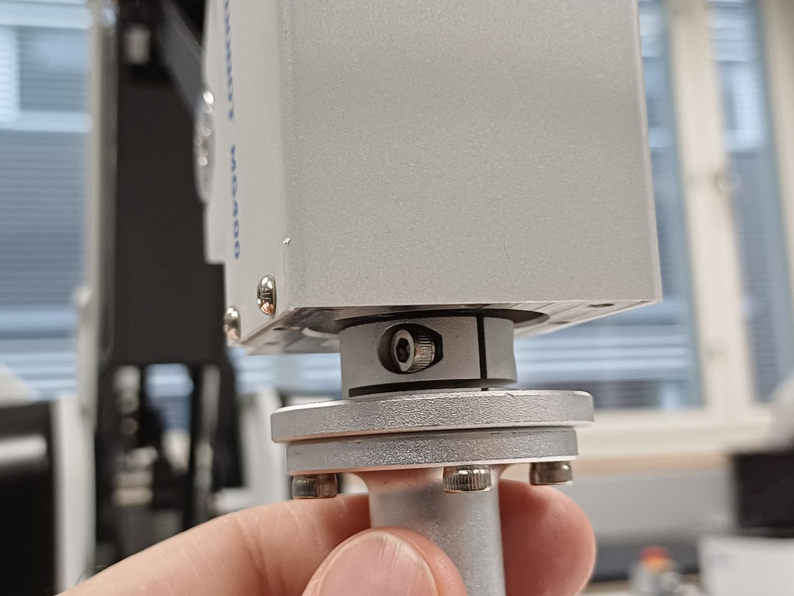

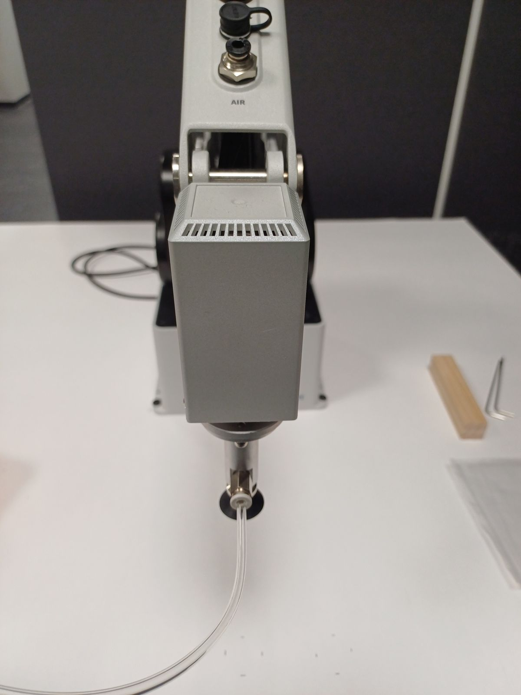

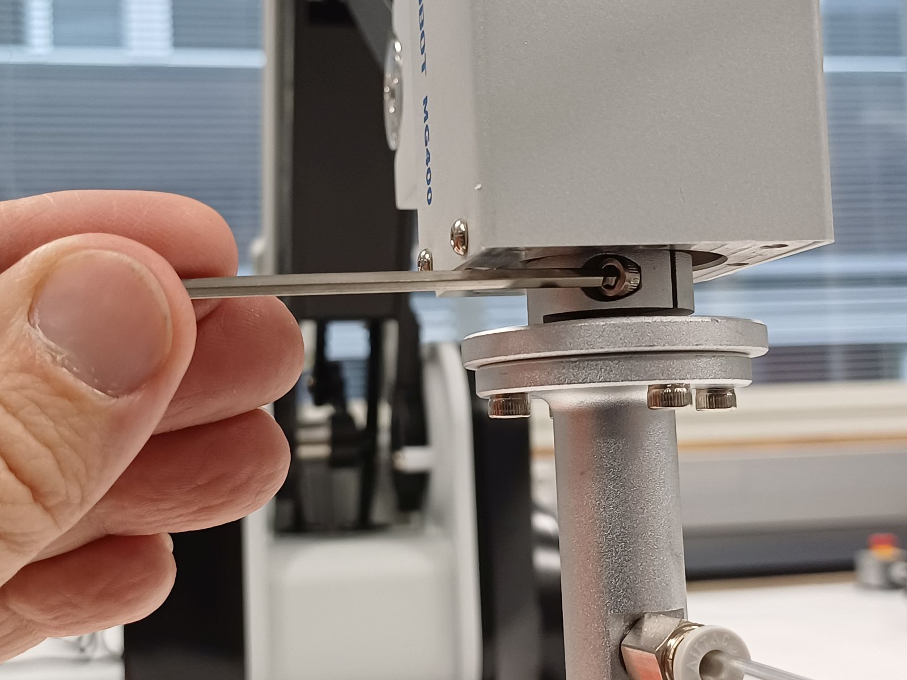

Connect the other end of the pipe to the connector marked _Air_ in the forearm.

Now, let's setup the vacuum pump. The pump receives power from the robot (pins 24 V and GND). Besides that, it has two control signals: vacuum and pressure. Connect the 4-pin terminal bar to the pump, and check if the wires are in the correct sequence.

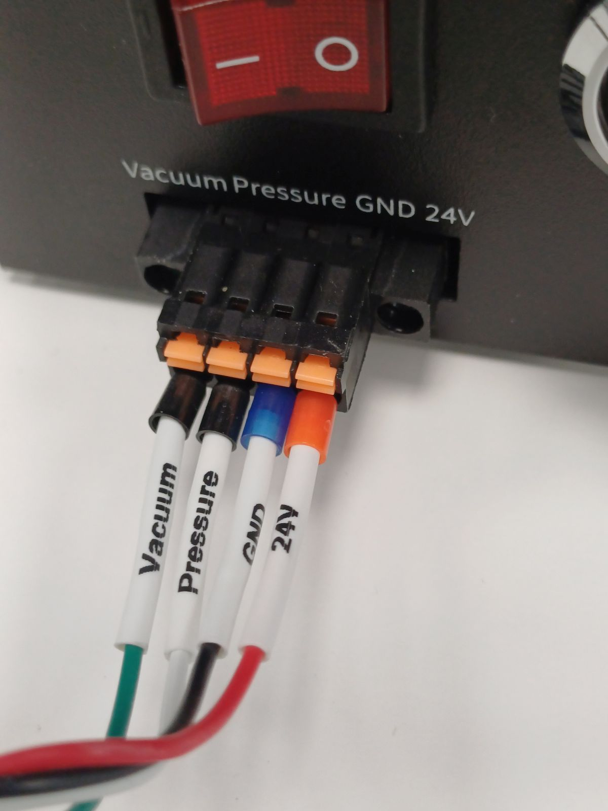

The other side of the cable should be attached to the interface board of the robot.

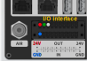

Note that you need **two** 10-pin terminal bars, because 24 V is in the upper I/O interface and GND in the lower I/O. The control signals _Vacuum_ and _Pressure_ are to be connected as digital **outputs**, in this case DO1 and DO2. Prepare the two terminal bars as shown in the image.

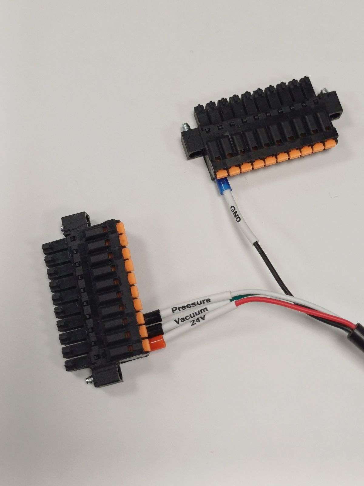

It is easier if you connect first the terminal bar with GND to the **lower** I/O interface.

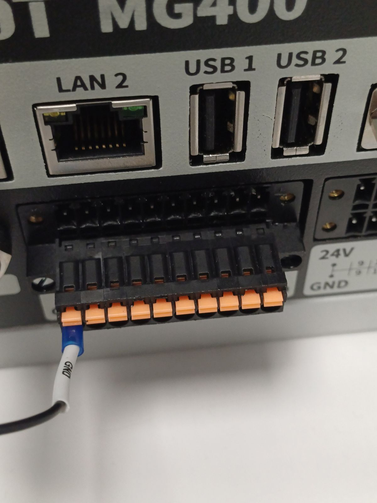

And the other terminal bar with 24V, Vacuum, Pressure to the upper I/O interface.

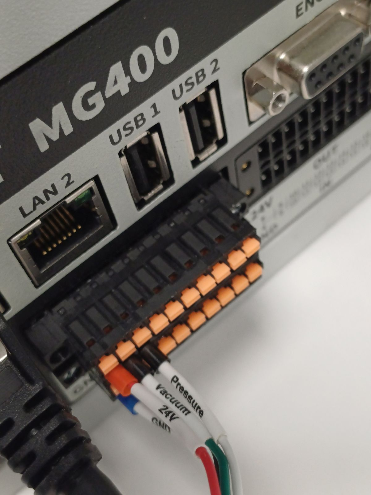

Finally, connect one side of the pipe to the _Air_ connector in the interface board of the robot and the other side to the vacuum pump. Turn on the pump.

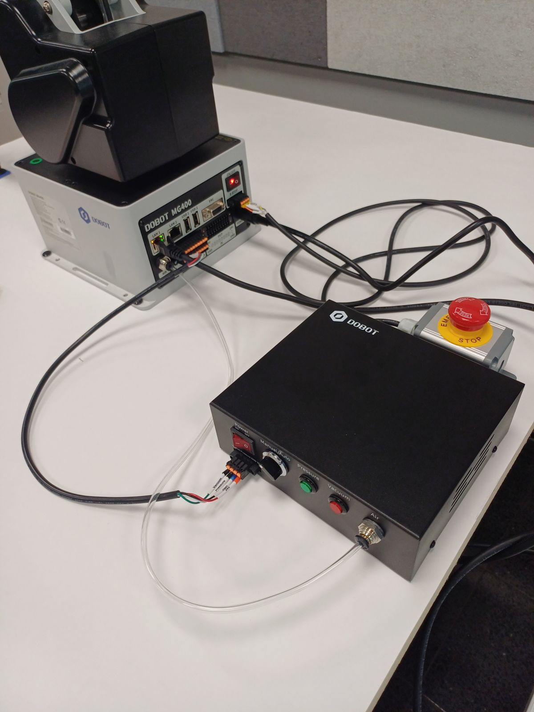

## Controlling the vacuum pump

There is a switch in the pump to set manual or auto control. If in manual control, the green and red buttons, marked _Pressure_ and _Vacuum_, turn on and off air or vacuum output. You can try one button at each time.

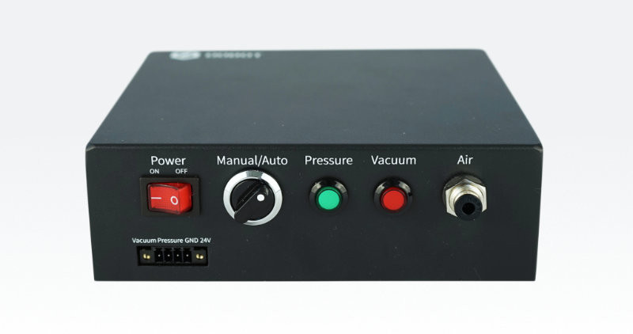

In automatic control, the pump receives control signals. This is the operation mode we use from now on, so turn the switch to _Auto_.

For testing, you can use the I/O panel in Dobot Studio. Try it.

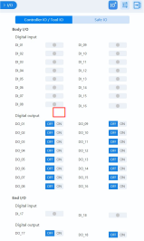

## Checking the height to pick a mosaic title

In this lab, you start picking and placing mosaic titles with dimensions 24 x 24 x 4mm. The vacuum cup is expected to touch the top of the table with Z coordinate -161.5 mm (it depends of how deep the gripper was attached to the tool shaft). Then, to touch the top of the mosaic title, the coordinate should be -161.5 + 4mm = -157.5 mm. Since there is this variation in the attachment of the gripper to the tool shaft, you need to test what is the correct height for your setup:

1. Create a pose ```(350, 0, -157, 0)``` in Dobot Studio.
2. Move to this pose.
3. Position a mosaic title exactly below the vacuum cup.
4. Turn on the vacuum (digital output 1).
5. If the cup does not grab the title, turn off the vacuum.
6. Move the arm 0.1 mm down. Use the step mode in the control panel. Then repeat steps 4 to 6 until the cup grabs the mosaic title.

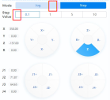

In my tests, the Z coordinate was -157.4 mm.

:warning: If you move too fast to a coordinate outside the workspace, you will get an error. So, do it carefully.

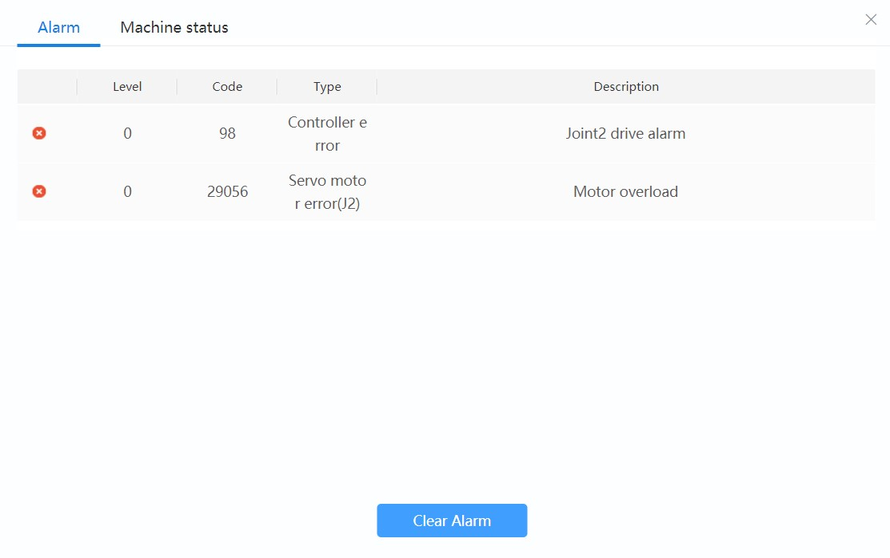

## Programmming with RoboDK

There is a [station in RoboDK with the vacuum gripper](https://github.com/fspacheco/robot-program/blob/main/RoboDK/box/suction-cup/HAMK_Vacuum_gripper_MG400.rdk) and an adjusted reference frame.

The station has a mosaic title to pick and a box to place the title. The target _Pick 1_ has Z coordinate -157 mm. You should adjust to the value you found in your tests.

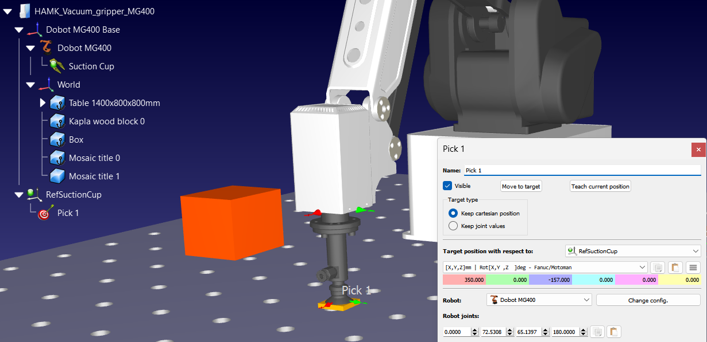

Then create more targets:
- _Approach 1_, 30 mm higher than _Pick 1_
- _Place in box_, located in the middle of the orange box
- _Approach box_, 30 mm higher than _Place in box_

To control the vacuum, you use the IO command. IO name refers to the digital output, and IO value, to the status, on (1) or off (0).

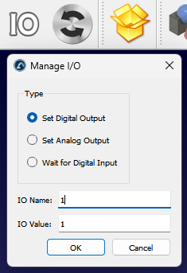

When you turn on the vacuum, you need to wait some time before moving, to make sure the object is firmly attached to the cup. You need to experiment how long is enough. The same is valid when you turn off the vacuum, otherwise the object is not completely released.

The targets to approach the object and the box are needed to avoid the arm scratching the surface or hitting the box. Then, your program is like:

- move to _Approach 1_
- move to _Pick 1_
- turn on the vacuum
- wait for vacuum being formed
- move to _Approach 1_
- move to _Approach box_
- move to _Place in box_
- turn off the vacuum
- wait for vacuum being released
- move to _Approach box_

Think about what type of movement is needed in each step: linear or joint?
Answer it, take a screenshot of your program and add to your notebook :notebook:

Set the post-processor to _Dobot MG400 lua_, generate the program for the MG400 and run it using Dobot Studio. Check the [instructions for the getting started lab](https://github.com/fspacheco/robot-program/blob/main/DobotStudio/lab-getting-started-mg400.md#robodk-and-mg400).

## Document your work

Today, simply add an entry in your engineering notebook with:
- answers to the questions indicated with the sentence "add to your notebook :notebook:"
- comment about any problem or issue you encountered. Also share your achievements!

## Turn off

Remember to disable the robot, power off, then disconnect the power and network cables.