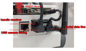
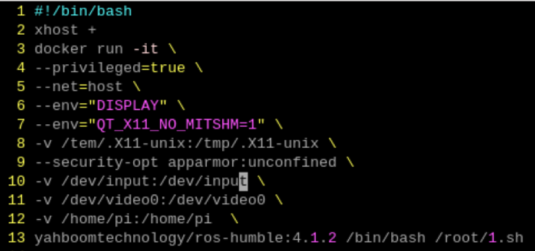

# Getting started with the mobile robot MicroROS-Pi5

This robot has two boards: one is a Raspberry Pi 5 with ROS 2 Humble. The second one is a MicroROS control board with ESP32. Refer to the manual in [http://www.yahboom.net/study/MicroROS-Pi5](http://www.yahboom.net/study/MicroROS-Pi5)

## Joystick operation

The MicroROS-Pi5 mobile robot can be controlled using a joystick controller (teleoperation) or using ROS 2.

First, let's use the controller. Turn on the robot.



It takes about 30 seconds to start the operating system in the Raspberry Pi. You can press the START button on the controller. If the buzzer of the car makes a beep sound, it means that the controller can be used.

To move the car, first press R1, then use the left and right joysticks.

**Note**: In our tests, we noticed interference with 5 or more controllers being used at the same time.

<!--
Strangely, this is not needed. Although all have the same ROS_DOMAIN_ID=20, no conflict arrised. In fact, when I followed the instructions, they stopped working. 

## Setup to have multiple robots in the same network

Instructions from manual http://www.yahboom.net/study/MicroROS-Pi5 04. Quick start control course / 1. Self start handle control

Inside the docker container
```
vi ~/.bashrc
(line 100) export ROS_DOMAIN_ID=X
vi /usr/lib/systemd/system/supervisor.service
(lines 7 and 9) export ROS_DOMAIN_ID=X
```

Outside the docker container

```
(pi@raspberrypi) vi config_robot.py
(line 496) robot.set_ros_domain_id(X)
docker ps
docker commit 77c1aa2c8350 yahboomtechnology/ros-humble:5.0
docker images
vi ros2_humble.sh
(line 12) yahboomtechnology/ros-humble:5.0
```
-->

## Accessing the OS in the robot

Use VNC or ssh.

## Setting up a mounting point

The ROS2 system is inside a Docker container.  If it is not activated, you can activate with `./ros2_humble.sh`. What you write inside the container will disappear when you close it. So, the recommendation is to create a mounting point outside of the container that can be accessed inside it:

- Add one line `-v /home/pi:/home/pi` in the file `ros2_humble.sh`, as shown in the image (line 12).
- Rerun the container



Inside `/home/pi`, create a directory for your work.


## Using topics

List the topics. We are going to use three today:
- beep
- battery
- cmd_vel

Check the /beep topic. What is the interface? Use `ros2 topic pub` to turn on the beep.

Check the topic /battery. Use `echo` in the topic to check the current status.

Check the topic /cmd_vel. Then:
1. Publish a linear velocity in x to 0.1 to see the robot moving.
2. Create nodes similar to the ones you did for Turtlesim to make the robot move:
    - for a period
    - move in a square

## Fixing errors

If you have an error about setuptools when you run `colcon build`, like
```
Starting >>> example
--- stderr: example
/usr/lib/python3/dist-packages/setuptools/command/install.py:34: SetuptoolsDeprecationWarning: setup.py install is deprecated. Use build and pip and other standards-based tools.
  warnings.warn(
---
Finished <<< example [0.73s]

Summary: 1 package finished [0.91s]
  1 package had stderr output: example
```

This is a know problem in some versions of ROS (information at https://github.com/ament/ament_cmake/issues/382 and https://github.com/ament/ament_cmake/issues/382) 

A simple solution (but not the most elegant) is to downgrade the version of setuptools using `pip install setuptools==58.2.0`
