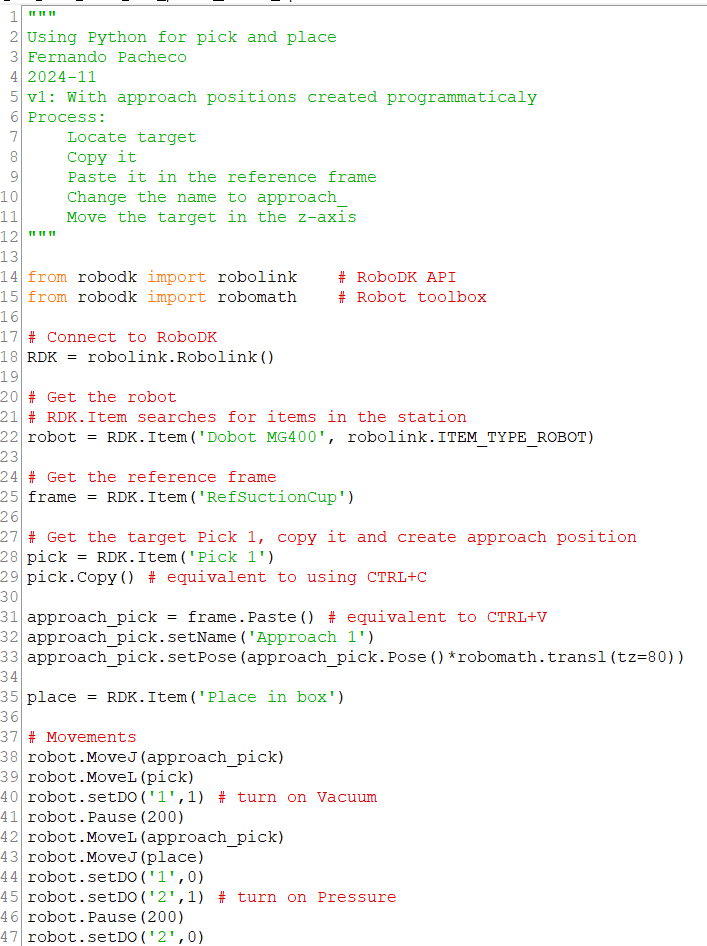

# Python in RoboDK for Dobot MG400

In this lab we will start using Python to program the Dobot MG400.

## Connections

:warning: Remember: if you are in doubt about any procedure, **ASK** for help **BEFORE** doing it.

Follow the same [instructions from the getting started lab](https://github.com/fspacheco/robot-program/blob/main/DobotStudio/lab-getting-started-mg400.md) for connecting the robot to network and powering it up. For connecting the vacuum gripper, the instructions are in the [lab about tools](https://github.com/fspacheco/robot-program/blob/main/DobotStudio/lab-mg400-tools.md).


## Checking the height to pick a mosaic tile

In this lab, you start picking and placing mosaic tiles with dimensions 24 x 24 x 4 mm. The vacuum cup is expected to touch the top of the tiles with Z coordinate -154 mm. Since there is some variation in the attachment of the gripper to the tool shaft, you need to test the correct height for your setup.

## Programming with RoboDK

There is a [station in RoboDK](https://github.com/fspacheco/robot-program/blob/main/RoboDK/box/suction-cup/HAMK_mosaic_vacuum_gripper_MG400.rdk) with the vacuum gripper and the holder for the mosaic tiles.

The station has a mosaic tile to pick and a box to place the tile into. The target _Pick 1_ has Z coordinate -154 mm. You should adjust to the value you found in your tests.


Then create one more target:
- _Place in box_, located in the middle of the orange box

### Version 0

Our first Python program uses the two targets _Pick 1_ and _Place in box_.


The movement in the simulation is as follows. Do not run this program in the real robot.

Why is this solution not considered the correct way to move? Answer in your notebook :notebook:.


### Version 1

We need approach positions, but this time we do not create them manually. Instead, we do with a Python program. First, let's create:
- _Approach 1_, that is 80 mm higher than _Pick 1_

The most important part is the use of `robomath.transl`. It is a function in the [RoboDK Python API](https://robodk.com/doc/en/PythonAPI/robodk.html#robodk.robomath.transl) that translates a pose: `robodk.robomath.transl(tx=0, ty=0, tz=0)`. The parameters are the axes to be translated (moved).



The movement is as follows. Note that the _Approach 1_ target was created and there is a linear movement between approach and pick positions.


You can use _Generate robot program_ to obtain the Lua code for running in the real robot. Test it in Dobot Studio. 


### Version 2

Create an approach position also for the box. In the program, create:
- _Approach box_, positioned 30 mm higher than _Place in box_

Use the same process of copy, paste, and translation.

### Version 3

For only one mosaic tile, it's easier to use the graphical interface. The great power of Python is when you need to repeat a process. Now, let's consider three mosaic tiles. Instead of creating each pick and approach positions manually, we do it in a program.

We already have _Pick 1_. Then, we need to create _Pick 2_ and _Pick 3_ as shown in the following image.


First, think about:
- What is the axis of translation (x, y, or z)?
- In what direction of the axis (positive or negative)?
- How much do you need to translate (mm)? You can measure in RoboDK and check in the physical holder.

Once you have these answers, the process is like this _pseudocode_
```
num_tiles = 3
Locate Pick 1
Copy Pick 1
Do a Loop: for i in range(2, num_tiles+1):
    Paste Pick 1 in the reference frame
    Change the name to Pick_i
    Modify Pick_i in the correct axis with transl
```

Try to do by yourself using [this template](template-loop-pick-v3.py). If you don't find a solution, [here is one](partial-solution-v3.py).

Then, do a similar process for the approach positions.

```
Do a Loop: for i in range(1, num_tiles+1):
    Paste Pick 1 in the reference frame
    Change the name to Approach_i
    Modify Approach_i in the y-axis and z-axis
```

The result should be like in the following image.


Try to do by yourself. If you don't find a solution, [here is one](partial-solution-with-approaches-v3.py).

Now, the movements. Again, you use a loop.

```
Do a Loop: for i in range(1, num_tiles+1):
    Locate Approach_i
    Locate Pick_i
    MoveJ(Approach_i)
    MoveL(Pick_i)
    Turn on vacuum
    Wait
    MoveL(Approach_i)
    MoveJ(Place)
    Turn off vacuum
    Turn on pressure
    Wait
    Turn off pressure
```

The result should be like in the following video.

[](https://www.youtube.com/watch?v=4671E9QwLTM)

When everything is ok in the simulation, generate the Lua code and run in the real robot.

## Optional

You can do programs to:
- Pick 6 tiles
- Add all the tiles in the mosaic holder, not only the pick positions
- Include the attach and detach events in the simulation
- Move the tiles to other places in the table, with different arrangements


# Part 2 - Rotation

Besides translation, you can also apply rotation to a pose. Since this robot has 4 DOFs, the only rotation you can use is for the _z_-axis: `robomath.rotz`. Important: the angle should be in radians. Check the [documentation](https://robodk.com/doc/en/PythonAPI/robodk.html#robodk.robomath.rotz).

In the station, there is an item called Kapla wood block. Use it since it is easier to see the rotation in action.

Define one pick position and one place position manually. Then, create new pick and place positions in your Python program. For instance:
- translate pick positions in y-axis
- do similar for approach pick positions
- translate and rotate place positions in z-axis
- do similar for approach place positions

Check the example in the following video with 3 wood blocks.

[](https://www.youtube.com/watch?v=sZ77uhvIT8Q)

Once you understand the process you can scale for more blocks, as shown in the following video.

[](https://www.youtube.com/watch?v=_LVNP_jNXco)

You can also apply both translation in _x_- or _y_-axis and rotation in the place positions to stack the blocks with different geometries.


Image from https://uptimefab.com/2022/02/07/dobot-mg400/

## Document your work

Report what you did in your engineering notebook in the repository [basics-prog](https://github.com/ICT-Robotics/basics-prog) and also comment about any problem or issue you encountered. Also share your achievements!

## Turn off

Remember to disable the robot, power off, then disconnect the power and network cables. You don't need to remove other cables.