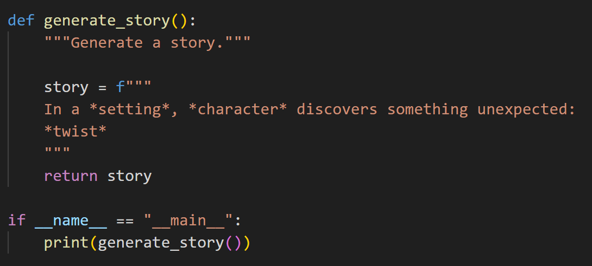
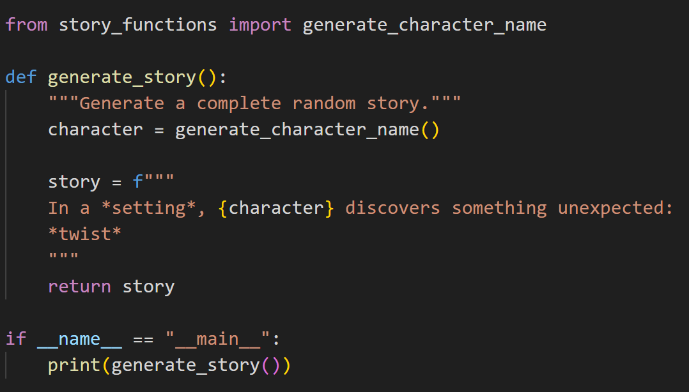
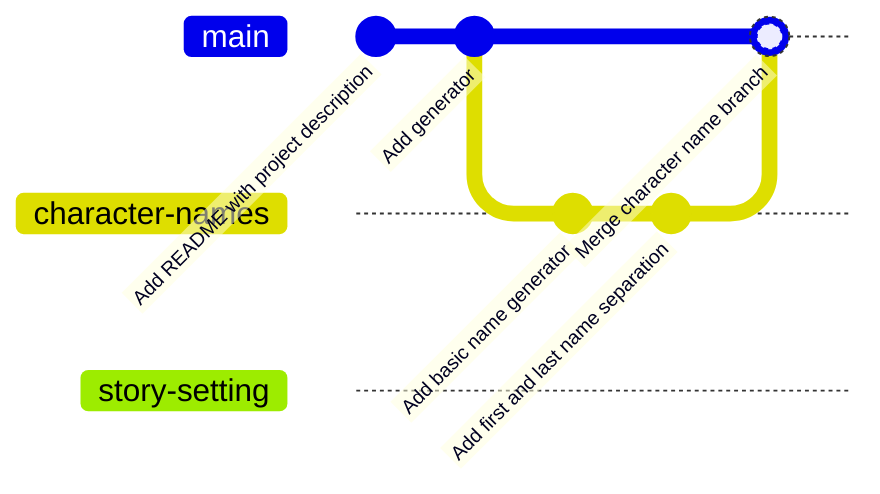

# Git Practice

The main goal of this activity is to practice Git **commands** through the development of a Python project. We are going to explore commands for local repositories. The most important commands are in this [Developer Skills list](https://github.blog/developer-skills/github/top-12-git-commands-every-developer-must-know/).

The code is a story generator, that should create random outputs like:

> In a abandoned castle, Diana Kumara discovers something unexpected:
    The world is actually a simulation

> In a remote mountain village, Elena Rana discovers something unexpected:
    The villain is a misunderstood hero


## Install git

Check if you have Git available opening a terminal and typing `git`. If the answer is the help message with a list of commands, then it is ok. Otherwise, you can check installation instructions from [Developer Skills tutorial](https://github.blog/developer-skills/programming-languages-and-frameworks/what-is-git-our-beginners-guide-to-version-control/#how-do-i-install-git).

## Create an empty repository

Create a folder and then initialize it as a Git repository with
```
git init -b main
```

Create a file README.md with the content
```markdown
# Story Generator Project
```

## First commit

Now, check the status of the repository with `git status`. There is a new file. Add this file to the version control with `git add README.md`. Check again with `git status`. Finally, commit with `git commit -m "Add README with project description"`.

:exclamation: You can understand a commit as a :camera: snapshot. Imagine you are assembling a machine and for each part you add, you take a picture for remembering the steps you followed. This is like a commit.

## The main program

Then, add a file `story_generator.py` with the content


<!--
```python
def generate_story():
    """Generate a story."""
    
    story = f"""
    In a *setting*, *character* discovers something unexpected:
    *twist*
    """
    return story

if __name__ == "__main__":
    print(generate_story())
```
-->

Save the file, and test with `python story_generator.py`. When it runs smoothly, without errors, check the status of the repository with `git status`. You can add the file with `git add story_generator.py`. Then, commit with `git commit -m "Add generator"`.

## Character names

Now, let's create a new branch, `character-names` to include random names:
`git checkout -b character-names`. Check that you are in the new branch with `git branch`.

Create another file, `story_functions.py`, with the code

```python
import random

def generate_character_name():
    names = ['Ana', 'Beatriz', 'Clarissa'] # you can choose other names
    return random.choice(names)
```

Then, change `story_generator.py` to include the random names:


<!--
```python
from story_functions import generate_character_name

def generate_story():
    """Generate a complete random story."""
    character = generate_character_name()
    
    story = f"""
    In a *setting*, {character} discovers something unexpected:
    *twist*
    """
    return story

if __name__ == "__main__":
    print(generate_story())
```
-->

Test it, check the status, add the files and commit with the id "Add basic name generator". You can check what is new with `git show`.

### Including surnames

Then, let's increment the name generator to include surnames in `story_functions.py`.

```python
def generate_character_name():
    """
    Generate a random character name.
    
    Returns:
        str: A randomly generated character name
    """
    first_names = ['Ana', 'Beatriz', 'Clarissa', 'Diana', 'Elena']
    last_names = ['Rana', 'Gurung', 'Rai', 'Magar', 'Kumara']
    
    import random
    return f"{random.choice(first_names)} {random.choice(last_names)}"
```

Test it, when it's ok, add and commit with id "Add first and last name separation".

## Story setting

For the moment, it's enough for the names. Now, let's work in the story setting. Create a new branch with `git checkout -b story-setting`

In `story_functions.py`, create a new function
```python
def generate_story_setting():
    """
    Generate a random story setting.
    
    Returns:
        str: A randomly generated story setting
    """
    settings = [
        'mysterious forest',
        'abandoned castle',
        'futuristic city',
        'remote mountain village',
        'underwater research station'
    ]
    
    import random
    return random.choice(settings)
```

## Need to merge!

Let's imagine now that you need to demo your story generator as it is. So, before testing your last function `generate_story_setting()`, you need to return to the branch with only the names and merge it to the main branch.

If you try to go directly to another branch, you will receive an error message:

```
error: Your local changes to the following files would be overwritten by checkout:
        story_functions.py
Please commit your changes or stash them before you switch branches.
Aborting
```

You need to store the current (unfinished) status. There is a command for that: `git stash`. It is like: "save temporarily what I did here".

To go to another branch, use `git checkout main`. Then, you merge the branch `character-names` to main with `git merge character-names`.



## Back to story-setting

Now, let's return to the previous point with `git checkout story-setting`.

Modify `story_generator.py` accordingly and test it with `python story_generator.py`. When it's ok, add the files and commit with id "Add basic setting generator".

## Plot twist

Now, the plot generator. Create a new branch with `git checkout -b plot-generator`

Then, add the function to `story_functions.py`:
```python
def generate_plot_twist():
    """
    Generate a random plot twist.
    
    Returns:
        str: A randomly generated plot twist
    """
    plot_twists = [
        'The world is actually a simulation',
        'An ancient prophecy comes true',
        'The villain is a misunderstood hero'
    ]
    
    import random
    return random.choice(plot_twists)
```

Change `story_generator.py` accordingly, test it, add the files and commit with id "Create initial plot twist function".

## Merge

Go back to the branch `character-names`with `git checkout character-names`.