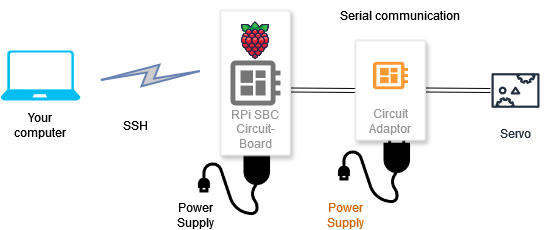
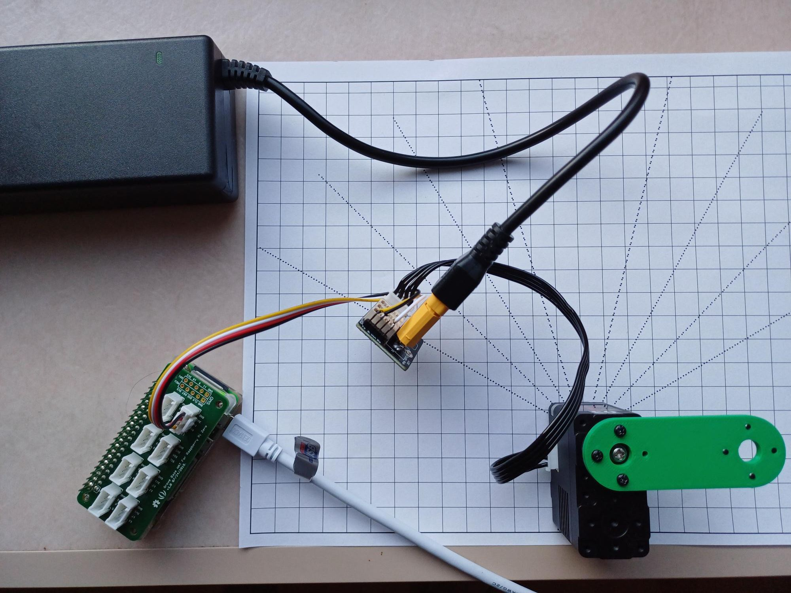

# Getting started with Lynxmotion servomotors

## Introduction

For creating your own robotic arm, you will use [Lynxmotion smart servomotors](https://wiki.lynxmotion.com/info/wiki/lynxmotion/view/ses-v2/lynxmotion-smart-servo/).


These motors are easier to control than a standard servomotor because they 
include a microcontroller that implements a serial communication protocol. The electronics inside the servo include the following:
- H-bridge motor controller
- Microcontroller (Cortex M0)
- Magnetic position sensor
- Voltage sensor
- Temperature sensor
- Current sensor


In [serial communication](https://learn.sparkfun.com/tutorials/serial-communication), bits are transmitted in sequence (in opposition to parallel communication), and the number of wires is minimal: basically a receiver RX, a transmitter TX, and GND.


The block of circuitry responsible for implementing serial communication is called universal asynchronous receiver-transmitter (UART).

Serial communication is available basically in any microcontroller.

Each Lynxmotion servo has an ID (a number) that is used in the communication. You can have many servos chained and send a command to a specific servo using its ID.

## Lynxmotion serial protocol

For serial communication, first you need to establish the communication, setting the speed (baud rate), parity bit, and other parameters. You do it once, keep the communication channel active, send and receive data, and close the channel in the end.

In the [Lynxmotion protocol](https://wiki.lynxmotion.com/info/wiki/lynxmotion/view/ses-v2/lynxmotion-smart-servo/lss-communication-protocol/#HSerialProtocol), there are **action** commands, that is, to tell the servo to do some action.

Action commands are sent serially to the servo's Rx pin and must be sent in the following format:

- Start with a number sign # (Unicode Character: U+0023)
- Servo ID number as an integer (assigning an ID described below)
- Action command (one or more letters, no whitespace, capital or lowercase from the list below)
- Action value in the correct units with no decimal
- End with a carriage return \r or <cr> Unicode Character (U+000D)

For example, `#5D1800<cr>` sends a serial command to all servo's RX pins which are connected to the bus and only servo(s) with ID #5 will move to a position (1800 in tenths of degrees) of 180.0 degrees.

## Example code

This is an example code that you can run in the RPi to move the servo.

```
#This is an example on writing serial commands
#to the Lynxmotion SES-V2 smart servos.
#LSS-ADA board is used on connecting RPi serial
#  RPi -- LSS-ADA
#  GPIO14 Tx -- D1 servo Rx
#  GPIO15 Rx -- D0 servo Tx
#  GPIO GND -- GND
#The Lynxmotion SES-V2 servo serial 115200, parity none, 8 bits, stop bits 1

#Serial port settings
#  Preferences, Raspberry Pi Configuration
#    Serial Port ON
#
#  sudo raspi-config
#   Interface Options
#    Serial port
#     "Would you like a login shell to be ..." NO
#      "Would you like the serial port hardware.." YES
#        Enter
#         Esc
#          sudo reboot
#
#Lynxmotion Smart Servo LSS Communication protocol: search for "Lynxmotion wiki" and
#open the Smart Servo (LSS), LSS Communication Protocol. 

from time import sleep
import serial

bus = serial.Serial(
    port = '/dev/ttyS0',  #The "/dev/ttyACM0" is reserved for Bluetooth on RPi3, Zero2W and later
    baudrate = 115200,
    parity = serial.PARITY_NONE,
    stopbits =serial.STOPBITS_ONE,
    bytesize = serial.EIGHTBITS,
    timeout = 1
)

# **********************************
servoID='3' # IMPORTANT: CHANGE HERE to the number of your servo

# Simple movement
# Documentation: "Action Commands" in 
# https://wiki.lynxmotion.com/info/wiki/lynxmotion/view/ses-v2/lynxmotion-smart-servo/lss-communication-protocol
print('Moving to 0 degrees')
bus.write(f'#{servoID}D0\r'.encode()) # D indicates degrees
sleep(3)
print('Moving to 30 degrees')
bus.write(f'#{servoID}D300\r'.encode()) # D300 means 300 tenths of degrees = 30 degrees
sleep(5)

# With modifiers
# Documentation: "Modifiers" in 
# https://wiki.lynxmotion.com/info/wiki/lynxmotion/view/ses-v2/lynxmotion-smart-servo/lss-communication-protocol
print('Moving to -90 degrees in 1.5 second')
bus.write(f'#{servoID}D-900T1500\r'.encode()) # T1500 means 1500ms = 1.5 second
sleep(5)

# Using a loop
counter = 0
step = 15  # in degrees
reply = "reply"  
angleDeg = 0

print("Turning servo to 0.0 degrees and then in steps\n")
while (step*counter <= 90):
    print(f'Moving to {step*counter} degrees')
    bus.write(f'#{servoID}D{step*10*counter}T1500\r'.encode())
    counter +=1
    sleep(5)

print("Finished with the servo. Closing serial port.")
bus.close()
del bus
```

## Wiring for this lab

We could use your computer to send commands to the servo, but you would need to have a USB-to-serial converter and probably install a (software) driver for this converter. To avoid issues with the installation, in this lab we use another approach. You will connect via SSH to a single-board computer (SBC), a Raspberry Pi 2W Zero. The RPi Zero will be connected to the Lynxmotion servomotors.





**Important**: connect the cable to **UART**


