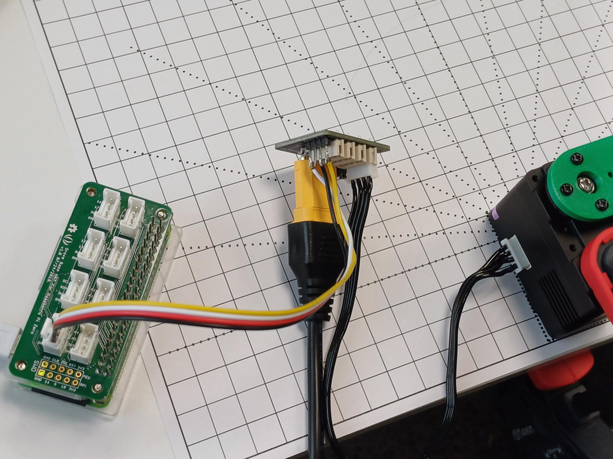

# Two-link robotic arm with Lynxmotion servomotors

## Introduction

After developing the forward kinematics equations, it is time to use them in a physical robot. You will build a two-link arm with [Lynxmotion smart servomotors](https://wiki.lynxmotion.com/info/wiki/lynxmotion/view/ses-v2/lynxmotion-smart-servo/).


As you now know, each Lynxmotion servo has an ID (a number) that is used in the communication. You can have many servos **chained** and send a command to a specific servo using its ID. This is exactly what we are going to do.

## Adjusting the position of the links

In the previous lab, you connected a link (green piece) without checking the position with zero angle. Now, this is a very important step to verify.

Take the program you wrote [previously](https://github.com/fspacheco/robot-program/blob/main/kinematics/lab-getting-started-lynxmotion.md), copy to a new file and keep only the part for setting the angle to zero.

### Servo A
Run the program to set the angle to zero and then adjust accordingly the position of the green link, that should point to the left, as shown in the following image. So:
1. Run the program to set the angle to zero
2. Adjust the position of the green link (unscrew, adjust, and screw it again)


### Servo B

For the second servo, the position is different. Fix it as shown in the following image:
- the servo will be upside down!
- the cable of the second servo is connected to the first one (chain connection)

Then, using your program, set the angle of the second servo to zero. Remember that the ID is different in your program.


After setting the angle to zero, connect the second green link as follows.


## Wiring for this lab

Just to review: we have a diagram that is similar to the [Getting started lab](https://github.com/fspacheco/robot-program/blob/main/kinematics/lab-getting-started-lynxmotion.md), now with an additional servo.




**Important**: connect the cable to **UART**


Second servo is connected in the first one (chain connection).


## Adjusting the direction of rotation (gyre)

Check the standard diagram for angles in Lynxmotion servos in the following image.


Does it follow the right-hand rule?

The answer is NO! You can note that Lynxmotion angles increase in the clockwise (CW)direction, and the right-hand rule sets the increase to the counterclockwise (CCW) direction.

So, for servo A, we want to have increasing angles in the counterclockwise direction. Servo B is upside down, so the Lynxmotion direction is ok, because when it is upside down, it will also be in the counterclockwise direction.

There is a command in the Lynxmotion protocol to set the direction of rotation. It is called [Gyre Direction](https://wiki.lynxmotion.com/info/wiki/lynxmotion/view/ses-v2/lynxmotion-smart-servo/lss-communication-protocol/#HGyreDirection28G29) (G). To set to CCW, we use `G-1`: for instance, with servo with ID 99, the command is `#99G-1<cr>`

## Example code for two servos

This is an example code that you can run in the RPi to move two servos interactively.

```python
#This is an example on writing serial commands
#to TWO Lynxmotion SES-V2 smart servos.
#LSS-ADA board is used on connecting RPi serial
#  RPi -- LSS-ADA
#  GPIO14 Tx -- D1 servo Rx
#  GPIO15 Rx -- D0 servo Tx
#  GPIO GND -- GND
#The Lynxmotion SES-V2 servo serial 115200, parity none, 8 bits, stop bits 1

#Serial port settings
#  Preferences, Raspberry Pi Configuration
#    Serial Port ON
#
#  sudo raspi-config
#   Interface Options
#    Serial port
#     "Would you like a login shell to be ..." NO
#      "Would you like the serial port hardware.." YES
#        Enter
#         Esc
#          sudo reboot
#
#Lynxmotion Smart Servo LSS Communication protocol: search for "Lynxmotion wiki" and
#open the Smart Servo (LSS), LSS Communication Protocol. 

from time import sleep
import serial

bus = serial.Serial(
    port = '/dev/ttyS0',  #The "/dev/ttyACM0" is reserved for Bluetooth on RPi3, Zero2W and later
    baudrate = 115200,
    parity = serial.PARITY_NONE,
    stopbits =serial.STOPBITS_ONE,
    bytesize = serial.EIGHTBITS,
    timeout = 1
)

# **********************************
servoID_A='3' # IMPORTANT: CHANGE HERE to the number of your servo A
servoID_B='4' # IMPORTANT: CHANGE HERE to the number of your servo B

# Also IMPORTANT: change gyre direction to counterclockwise (CCW) for servo A
bus.write(f'#{servoID_A}G-1\r'.encode()) # CCW: -1
bus.write(f'#{servoID_B}G1\r'.encode())  # CW: +1

# Optional: LED colors (0: off; colors 1 to 7)
bus.write(f'#{servoID_A}LED6\r'.encode())
bus.write(f'#{servoID_B}LED5\r'.encode())

# Define angle limits. DON'T CHANGE
MIN_ANGLE1 = 0
MAX_ANGLE1 = 180
MIN_ANGLE2 = -120
MAX_ANGLE2 = 120

try:
    while True: # you finish the program with ctrl+c
        angle1 = int(input(f'Enter angle for 1st servo ({MIN_ANGLE1}–{MAX_ANGLE1}): '))
        if not (MIN_ANGLE1 <= angle1 <= MAX_ANGLE1):
            raise ValueError(f'Angle1 must be between {MIN_ANGLE1} and {MAX_ANGLE1} degrees.')

        angle2 = int(input(f'Enter angle for 2nd servo ({MIN_ANGLE2}–{MAX_ANGLE2}): '))
        if not (MIN_ANGLE2 <= angle2 <= MAX_ANGLE2):
            raise ValueError(f'Angle2 must be between {MIN_ANGLE2} and {MAX_ANGLE2} degrees.')

        # Documentation: "Action Commands" in 
        # https://wiki.lynxmotion.com/info/wiki/lynxmotion/view/ses-v2/lynxmotion-smart-servo/lss-communication-protocol
        print(f'Moving to {angle1}, {angle2} degrees')
        bus.write(f'#{servoID_A}D{angle1*10}T1500\r'.encode()) # D indicates degrees
        bus.write(f'#{servoID_B}D{angle2*10}T1500\r'.encode())
        sleep(3)
except KeyboardInterrupt:
    print("Finished with the servo. Closing serial port.")
    bus.close()
    del bus
```

## Activities

1. Check if the results of your forward kinematics program agree with the real robot you built.

2. Incorporate the code for forward kinematics in the program that you run in the Raspberry Pi.

3. Connect the boards with buttons (red, green, blue, white) accordingly and test the following code.

```python
# SerLab14 SeqLogic Interrupt
# A project with two Lynxmotion servos. Movements are manually
# controlled with push buttons
# Hardware:
# Raspberry Pi Zero 2 W with a "hat" for grove 4 pin connectors.
# Two ST1 servos or HT1 servos. In this example numbered 00, 01.
# LSS Power Hub for connecting 12 V power and serial communication.
# Four OFF-(ON) push buttons - for example two Grove dual button modules.
# Connect for programming test:
# Grove base hat for 4 pin connectors -- Buttons and Power Hub.
# 4 pin connector "D16" -- Grove dual button 4 pin connector.
# 4 pin connector "D5" -- Grove dual button 4 pin connector.
# 4 pin connector "UART" -- RX-TX, TX-RX, GND-GND, 3V3-No connection!
# Power Hub -- Lynxmotion servos either "line" or "star" topology.
# 12 Volt 4 Ampere power supply -- Power hub.
# The pigpio library is used. Documentation:  https://abyz.me.uk/rpi/pigpio
# Before running the python code, please type on the terminal "sudo pigpiod"
# Timo Karppinen 07.04.2025    Apache-2.0

import pigpio
import serial
from time import sleep

pi = pigpio.pi()   # New object pi inheriting methods from the pigpio class.

# Initialize the inputs
pi.set_mode(16, pigpio.INPUT)	# The default is input but better set it!
pi.set_mode(17, pigpio.INPUT)	# The previous code might have left it as output!
pi.set_mode(5, pigpio.INPUT)
pi.set_mode(6, pigpio.INPUT)


btn00 = 16	# Servo 00 "out"
btn01 = 17	# Servo 00 "home"
btn02 = 5	# Servo 01 "out"
btn03 = 6	# Servo 01 "home"

pi.set_pull_up_down(btn00, pigpio.PUD_OFF)	# There are pull up resistors on 
pi.set_pull_up_down(btn01, pigpio.PUD_OFF)	# on the Grove Dual Button module.
pi.set_pull_up_down(btn02, pigpio.PUD_OFF)	# If not using that, consider using
pi.set_pull_up_down(btn03, pigpio.PUD_OFF)	# pigpio.PUD_UP or external resistors.

# Serial communications for the servos
bus = serial.Serial(
	port = '/dev/ttyS0', # The /dev/ttyACM0 is reserved for Bluetooth on RPi
	baudrate = 115200,
	parity = serial.PARITY_NONE,
	stopbits = serial.STOPBITS_ONE,
	bytesize = serial.EIGHTBITS,
	timeout = 1
)

def outSer00(gpio, level, tick):	# Driving out to 90 degrees in 2 seconds
	bus.write((f'#00D{90*10}T{2*1000}\r').encode()) # Encoded to UTF-8
	print(f'Out command to Servo Nr 00 executed')
def homeSer00(gpio, level, tick):	# Driving home to 0 degrees in 2 seconds
	bus.write((f'#00D0T{2*1000}\r').encode())
	print(f'Home command to Servo Nr 00 executed')

def outSer01(gpio, level, tick):	# Driving out to 90 degrees in 4 seconds
	bus.write((f'#01D{90*10}T{4*1000}\r').encode()) 
	print(f'Out command to Servo Nr 01 executed')
def homeSer01(gpio, level, tick):	# Driving home to 0 degrees in 4 seconds
	bus.write((f'#01D0T{4*1000}\r').encode())
	print(f'Home command to Servo Nr 01 executed')

# callback function in pigpio library works like interrupt in C++, in real the edge is
# checked once in 5 microseconds
cb1 = pi.callback(btn00, pigpio.FALLING_EDGE, outSer00)
cb2 = pi.callback(btn01, pigpio.FALLING_EDGE, homeSer00)
cb3 = pi.callback(btn02, pigpio.FALLING_EDGE, outSer01)
cb4 = pi.callback(btn03, pigpio.FALLING_EDGE, homeSer01)

count = 0

while (count<120):
	while(count<1):
		print('Driving with the Lynxmotion servos\n')
		count += 1
		sleep(2)
	print(f'btn00 = {pi.read(btn00)}, btn01 = {pi.read(btn01)}, btn02 = {pi.read(btn02)}, btn03 = {pi.read(btn03)}')
	count += 1
	sleep(1)

# The callback should be stopped.
cb1.cancel()
cb2.cancel()
cb3.cancel()
cb4.cancel()
```